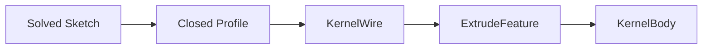

# Feature Modeling

Parametric features live in `opencad-feature` and execute through the kernel-neutral `GeometryKernel` trait.

## Pipeline



1. Sketches are solved and profiles detected in `opencad-sketch`.
2. `profile_to_solved()` converts a closed profile into `SolvedSketch`.
3. `GeometryKernel::make_wire_from_sketch()` builds a wire.
4. `ExtrudeFeature` calls `extrude()` and stores the resulting `KernelBody`.

## Core types

| Type | Role |
|---|---|
| `FeatureDefinition` | Serializable sketch / extrude payload |
| `FeatureNode` | Feature id, name, definition |
| `FeatureRegistry` | Dispatches executors by feature type |
| `PartModel` | Feature graph + sketches + regen outputs |
| `RegenContext` | Kernel + prior feature outputs |

## Regeneration

```rust
let mut model = bracket_base_plate()?;
let kernel = OcctGeometryKernel::new();
let registry = FeatureRegistry::with_defaults();
model.regenerate(&kernel, &registry)?;
```

Features run in topological order from `FeatureGraph::recompute_order()`. Suppressed features are skipped.

## Rules

- OCCT types stay in `opencad-kernel-occt`.
- Feature code never imports `cadrum` or OCCT FFI.
- Sketches must be solved (literal point coordinates) before extrude.

## Further reading

- [Geometry kernel boundary](./geometry-kernel.md)
- [Design graph](./design-graph.md)
